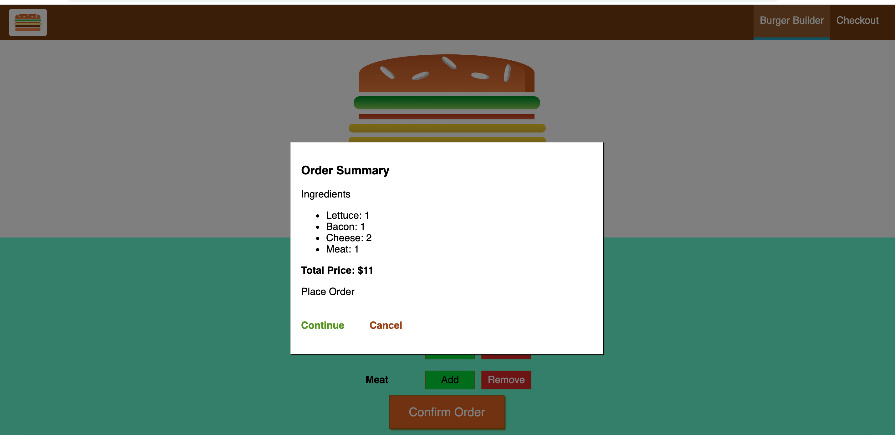

# Burger Builder App
A application that allows users to customize a burger and place an order. 

## Application Details
This in an application using React as part of the Udemy React course.
The application lets users to add or remove ingredients to a burger while the burger image on the screen updates.
The price of the burger also updates.
After customization, the users can review their burger and proceed to checkout and place an order.
The application is fully responsive and can be optimally used on mobile devices.

Currently the application is not connected to a server and database but this will be implemeted soon.

## Application Screenshot

## Link to Current Version
https://burger-builder-jihojk.herokuapp.com/